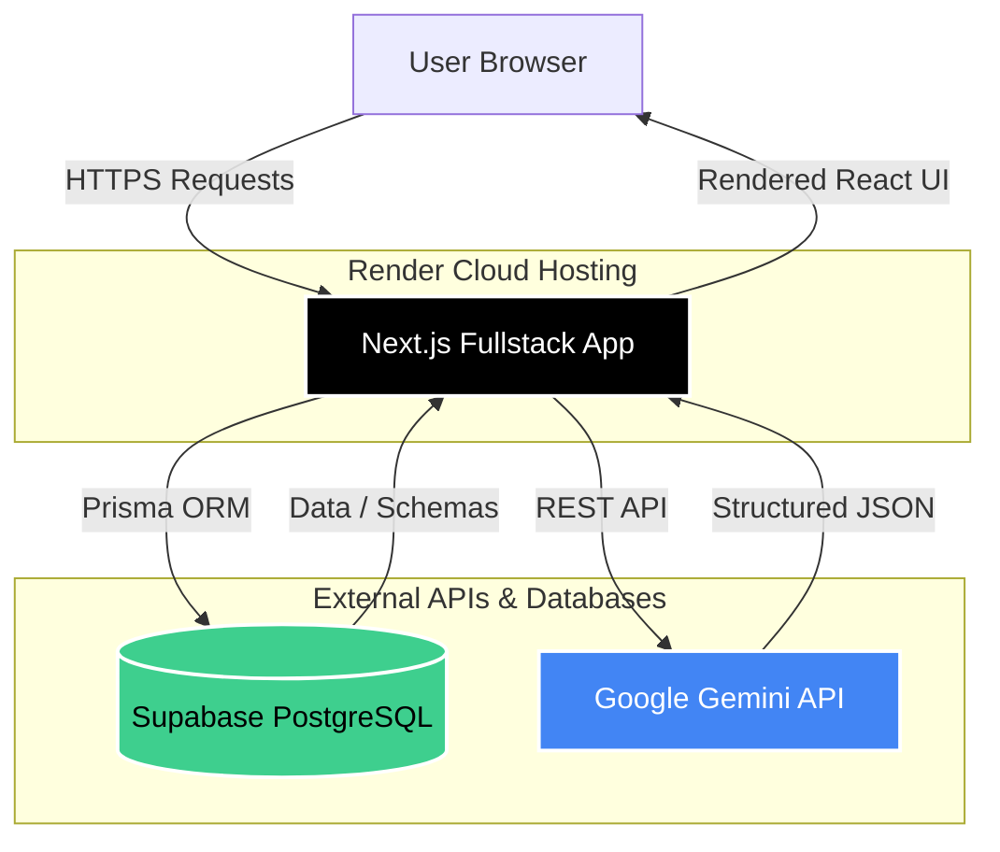
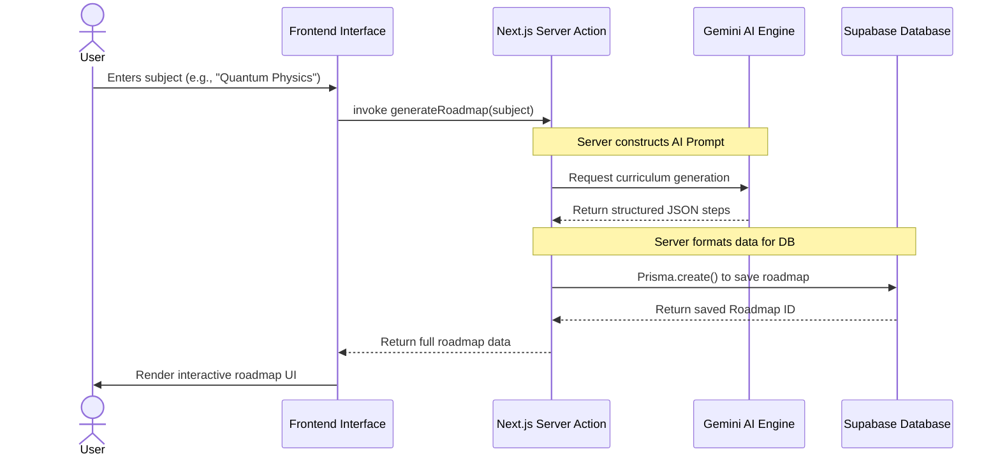
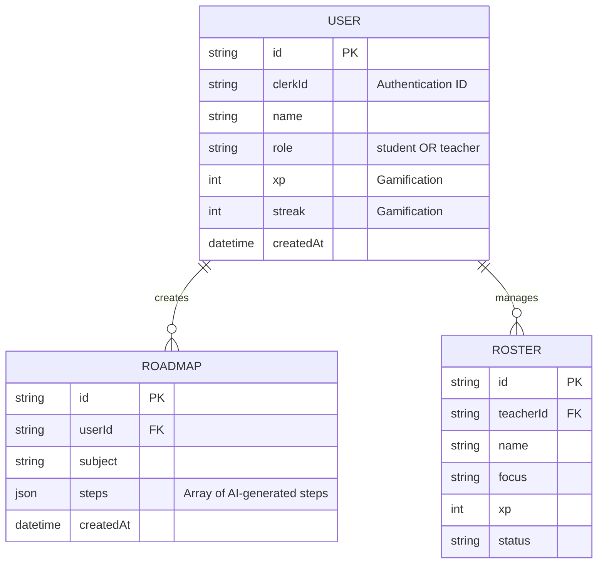

# Project Report: Adaptive Learning Intelligence Platform (ALIP)

**University:** Indus University, Ahmedabad  
**Team Name:** GitHappens  

## Team Members & Responsibilities

| Name | Role | Core Responsibilities |
| :--- | :--- | :--- |
| **Dhyey Oza** | Lead Developer | Overall system architecture, end-to-end integration, project management, and guiding core technical decisions. |
| **Dhyey Joshi** | Frontend & UI/UX | Designing intuitive user interfaces, implementing Tailwind CSS styling, creating Dark Mode, and ensuring responsive user experiences. |
| **Jayesh Upadhyay** | Backend Developer | Managing Prisma ORM models, configuring Supabase PostgreSQL databases, and building robust Next.js server actions. |
| **Tanmay Kasodniya** | AI Integration | Integrating the Google Gemini API, crafting optimal AI prompts, and structuring the JSON roadmap data pipeline. |
| **Pruthviraj Patel** | Testing & Documentation | Quality assurance, debugging codebase issues, validating Render deployments, and compiling comprehensive project reports. |

---

## 1. Project Overview
The **Adaptive Learning Intelligence Platform (ALIP)** is an AI-driven educational web application designed to revolutionize how students and educators approach learning. By dynamically generating personalized, step-by-step learning roadmaps based on user input, ALIP ensures that complex subjects are broken down into digestible, structured milestones. The platform incorporates gamification elements (XP and Streaks) and role-based access (Student and Teacher views) to maximize engagement and track long-term progress.

## 2. Problem Statement
Traditional education systems and static online courses often lack personalization. Every student has a unique pace and specific goals, yet they are typically forced into one-size-fits-all curriculums. Furthermore, when students attempt self-guided learning, they often feel overwhelmed and don't know where to start. Educators also struggle to track individual progress across diverse, personalized learning paths. 

**Solution:** ALIP solves this by leveraging Artificial Intelligence to generate customized learning roadmaps instantly. It provides dedicated role-based dashboards to keep students engaged through gamification, while giving teachers a clear, organized roster to maintain oversight over their students' progress.

---

## 3. Technology Stack
ALIP is built on a modern, robust, and scalable technology stack:

* **Frontend:**
  * **Next.js 15 (App Router):** Provides server-side rendering, routing, and React foundations.
  * **Tailwind CSS:** Utility-first CSS framework used for rapid UI development and styling.
  * **Lucide React:** Clean, consistent iconography.
* **Backend:**
  * **Next.js Server Actions:** Handles secure server-side logic and API communications.
  * **Prisma ORM:** Typesafe database client for seamless data manipulation and schema management.
* **Database & Cloud Services:**
  * **Supabase (PostgreSQL):** High-performance, scalable relational database handling user data and roadmaps.
  * **Render:** Cloud hosting platform providing continuous deployment directly from the GitHub repository.
* **Artificial Intelligence:**
  * **Google Gemini API:** The core intelligence engine responsible for generating structured, highly accurate educational curriculums in JSON format.

---

## 4. System Architecture
The system follows a modern full-stack serverless architecture. The Next.js framework operates as both the client interface and the backend API, acting as the orchestrator between the user, the database, and the external AI service.

---

## 5. Data Flow Diagram (Roadmap Generation)
The following sequence diagram illustrates the data flow when a user requests a new learning roadmap. It highlights the interaction between the client, the server, the AI model, and the database.

---

## 6. Entity Relationship (ER) Diagram
The PostgreSQL database is structured to support role-based users and their relational data.

---

## 7. Key Features & Functionality
1. **Dynamic Roadmap Generation:** Users receive tailored curriculums instantly. Each step includes a title, description, and an estimated timeframe.
2. **Role-Based Dashboards:** 
   * **Students:** View personal roadmaps, track XP, and monitor their learning streak.
   * **Teachers:** Manage a roster of students, view focus areas, and monitor classroom progress.
3. **Persistent Storage:** All generated roadmaps and user profiles are safely stored in Supabase, meaning users never lose their progress across sessions.
4. **Adaptive Dark Mode:** A sleek, modern user interface that seamlessly toggles between light and dark themes to reduce eye strain.

## 8. Future Enhancements
* **Authentication:** Full integration with Clerk for secure, multi-provider social logins (Google, GitHub, etc.).
* **Interactive Quizzes:** AI-generated pop quizzes at the end of each roadmap step to verify knowledge retention.
* **Social Sharing:** The ability for students to share their completed roadmaps and certificates on social platforms to boost community engagement.
